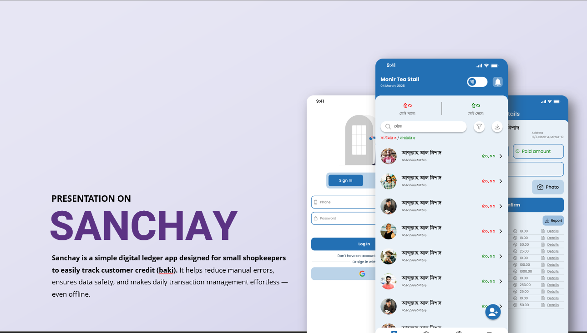
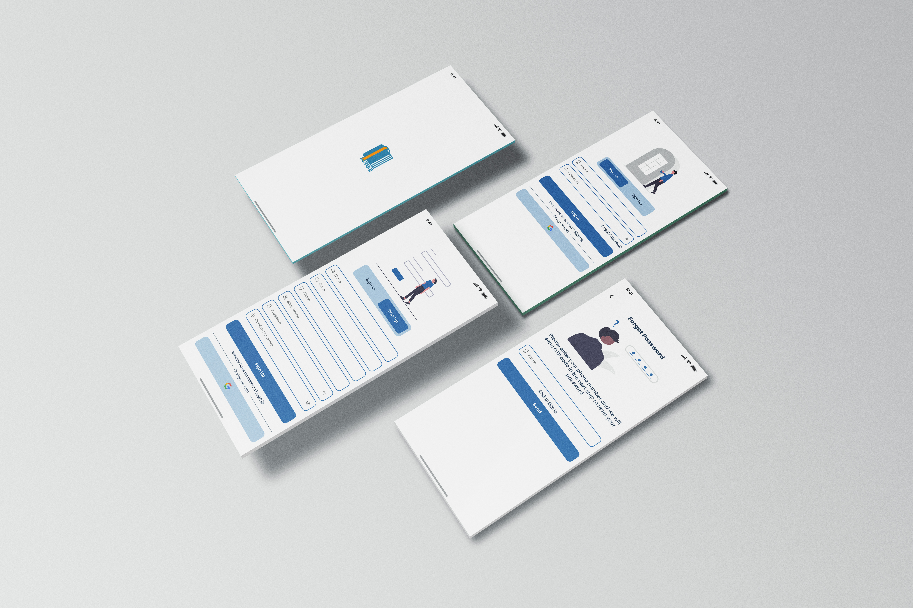
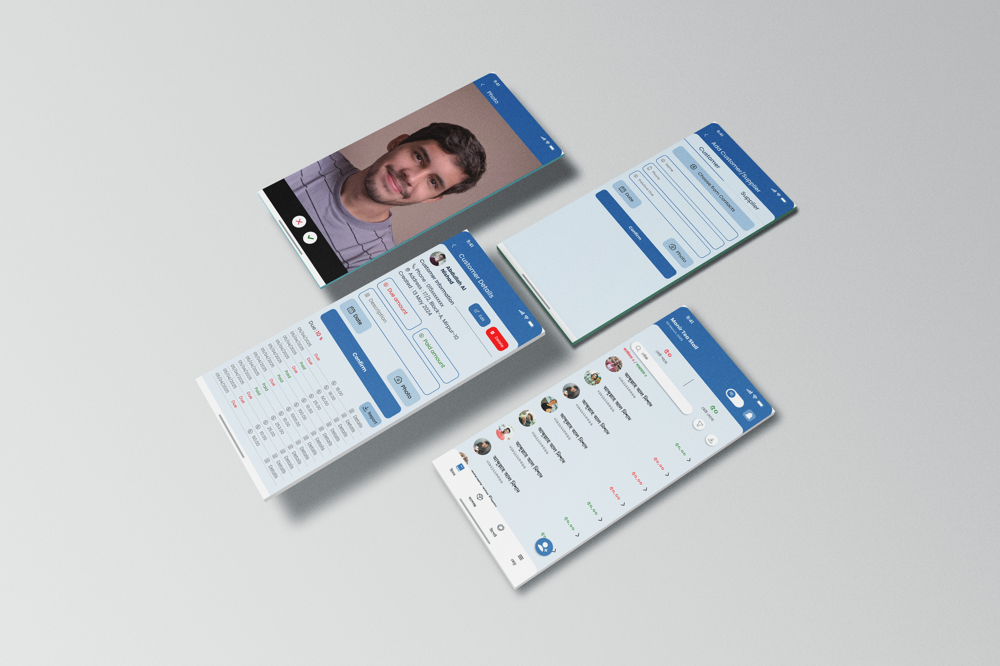

<!-- Banner Section -->

  

<h1 align="center">🚀 Sanchoy – Smart Digital Ledger App 📱</h1>

  <b>A lightweight and efficient digital ledger app for small businesses and shop owners</b> 
  Built with ❤️ using Flutter, Firebase & GetX

  
  
  
  

---

## ✨ Key Features
- 📒 **Add & Manage Accounts** – Maintain separate customer and supplier accounts.
- 💰 **Track Credits & Debits** – Real-time balance updates with every transaction.
- 📜 **Transaction History** – View records with search & filter options.
- 🎯 **Simple & Intuitive UI** – User-friendly design for all types of users.
- ⚡ **Fast & Scalable** – Powered by **Flutter** and **Firebase**.

---

## 💡 Why Sanchoy?
**Sanchoy** is designed to replace manual registers with a **digital, secure, and easy-to-use** ledger for local businesses.  
It’s perfect for shopkeepers, wholesalers, and small entrepreneurs who want to manage their finances with ease.

---

## 🛠 Tech Stack
| Technology | Purpose |
|------------|---------|
| **Flutter** | Cross-platform mobile app development |
| **Dart** | Programming language |
| **Firebase Firestore** | Real-time cloud database |
| **GetX** | State management |

---

## 🚀 Future Plans
- 🔔 Push notifications for transactions
- 📄 Downloadable PDF/Excel reports
- ⏰ Automatic customer payment reminders

---

## 📲 Download
📦 **[Click Here to Download APK](https://shorturl.at/75F6D)**

---

## 📷 Screenshots

  
  
  

---

## 👨‍💻 Developer
Developed by **Takiul Islam** as part of the **Software Development Project (SDP)**.  
Always open to feedback and ideas for improvement 🚀.

---

⭐ If you like this project, give it a star on GitHub!

